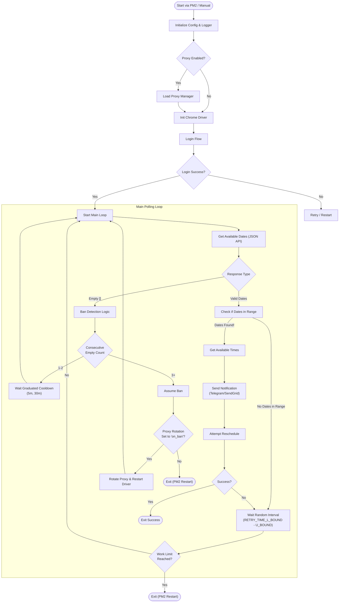
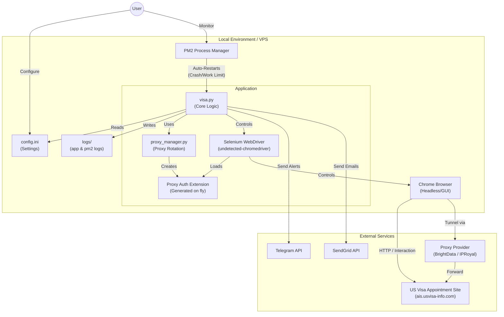

```mermaid
flowchart TD
    Start([Start via PM2 / Manual]) --> Init[Initialize Config & Logger]
    Init --> ProxyCheck{Proxy Enabled?}
    ProxyCheck -- Yes --> LoadProxies[Load Proxy Manager]
    ProxyCheck -- No --> InitDriver[Init Chrome Driver]
    LoadProxies --> InitDriver
    
    InitDriver --> LoginFlow[Login Flow]
    LoginFlow --> LoginSuccess{Login Success?}
    LoginSuccess -- No --> RetryLogin[Retry / Restart]
    LoginSuccess -- Yes --> MainLoop[Start Main Loop]

    subgraph MainPollingLoop["Main Polling Loop"]
        MainLoop --> GetDates["Get Available Dates (JSON API)"]
        GetDates --> CheckResponse{Response Type}
        
        CheckResponse -- "Empty []" --> BanCheck[Ban Detection Logic]
        BanCheck --> CountEmpty{"Consecutive<br/>Empty Count"}
        CountEmpty -- "1-2" --> WaitCool["Wait Graduated Cooldown<br/>(5m, 30m)"]
        CountEmpty -- "3+" --> HardBan[Assume Ban]
        WaitCool --> MainLoop
        
        CheckResponse -- "Valid Dates" --> CheckSlots[Check if Dates in Range]
        CheckSlots -- "No Dates in Range" --> WaitRandom["Wait Random Interval<br/>(RETRY_TIME_L_BOUND - U_BOUND)"]
        WaitRandom --> WorkLimitCheck{"Work Limit<br/>Reached?"}
        
        CheckSlots -- "Dates Found!" --> FetchTime[Get Available Times]
        FetchTime --> Notify["Send Notification<br/>(Telegram/SendGrid)"]
        Notify --> Reschedule[Attempt Reschedule]
        Reschedule --> Result{Success?}
        Result -- Yes --> ExitSuccess([Exit Success])
        Result -- No --> WaitRandom
        
        HardBan --> RotateProxy{"Proxy Rotation<br/>Set to 'on_ban'?"}
        RotateProxy -- Yes --> Rotate[Rotate Proxy & Restart Driver]
        Rotate --> MainLoop
        RotateProxy -- No --> ExitBan(["Exit (PM2 Restart)"])
    end

    WorkLimitCheck -- Yes --> ExitLimit(["Exit (PM2 Restart)"])
    WorkLimitCheck -- No --> MainLoop
```

---

```mermaid
graph TD
    User((User))
    
    subgraph "Local Environment / VPS"
        PM2[PM2 Process Manager]
        Config["config.ini\n(Settings)"]
        Logs["logs/\n(app & pm2 logs)"]
        
        subgraph "Application"
            VisaScript["visa.py\n(Core Logic)"]
            ProxyMgr["proxy_manager.py\n(Proxy Rotation)"]
            WebDriver["Selenium WebDriver\n(undetected-chromedriver)"]
            Extension["Proxy Auth Extension\n(Generated on fly)"]
        end
        
        Browser["Chrome Browser\n(Headless/GUI)"]
    end
    
    subgraph "External Services"
        TargetSite["US Visa Appointment Site\n(ais.usvisa-info.com)"]
        ProxyService["Proxy Provider\n(BrightData / IPRoyal)"]
        Telegram["Telegram API"]
        SendGrid["SendGrid API"]
    end

    %% Relationships
    User -- "Configure" --> Config
    User -- "Monitor" --> PM2
    PM2 -- "Auto-Restarts\n(Crash/Work Limit)" --> VisaScript
    VisaScript -- "Reads" --> Config
    VisaScript -- "Writes" --> Logs
    
    VisaScript -- "Uses" --> ProxyMgr
    VisaScript -- "Controls" --> WebDriver
    ProxyMgr -- "Creates" --> Extension
    WebDriver -- "Loads" --> Extension
    WebDriver -- "Controls" --> Browser
    
    Browser -- "HTTP / Interaction" --> TargetSite
    Browser -- "Tunnel via" --> ProxyService
    ProxyService -- "Forward" --> TargetSite
    
    VisaScript -- "Send Alerts" --> Telegram
    VisaScript -- "Send Emails" --> SendGrid
```

